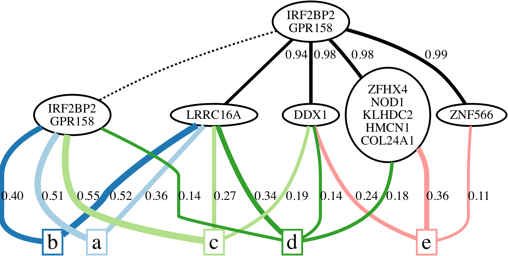

# AncesTree
AnncesTree is an algorithm for clonal tree reconstruction from multi-sample cancer sequencing data.

## Support

For support using AncesTree, please visit the [AncesTree Google Group](https://groups.google.com/forum/#!forum/ancestree).

## Dependencies

AncesTree is written C++. In addition to a recent C++ compiler, it has the following dependencies:

* [CMake](http://www.cmake.org/) (>= 2.8)
* [Boost](www.boost.org) (>= 1.38)
* [LEMON](http://lemon.cs.elte.hu/trac/lemon) graph library (>= 1.3)
* [CPLEX](http://www.ibm.com/developerworks/downloads/ws/ilogcplex/) (>= 12.0)

[Graphviz](http://www.graphviz.org) is required to visualize the resulting DOT files, but is not required for compilation.

## Compilation instructions

To compile AncesTree, execute the following commands from the root of the repository:

    mkdir build
    cd build
    cmake ..
    make
    
In case CMake fails to detect either CPLEX or LEMON, run the following command with adjusted paths:

	cmake \
	-DLIBLEMON_ROOT=~/lemon \
	-DCPLEX_INC_DIR=~/ILOG/cplex/include/ \
	-DCPLEX_LIB_DIR=~/ILOG/cplex/lib/x86-64_osx/static_pic \
	-DCONCERT_LIB_DIR=~/ILOG/concert/lib/x86-64_osx/static_pic \
	-DCONCERT_INC_DIR=~/ILOG/concert/include/ ..
	
The compilation results in the following files in `build` directory:

* *ancestree*, which is the main executable and will be described in the following. 
* analyse_solution
* analyse_solution_prob
* ancestree_ilp
* construct_ancestry_matrix
* visualize_solution 
	
## Usage instructions

The `ancestree` exectuable takes the following arguments as input:

	./ancestree [--alpha|-a num] [--beta|-b num] [--dot|-d str]
	   [--gamma|-g num] [--help|-h|-help] [--sol|-s str] [--time|-t int]
	   [--version|-v] read_count_file
	   
where

ARGUMENT       | DEFAULT | DESCRIPTION                                                
---------------|---------|-------------------------------------------------------------
--alpha/-a     | 0.3     | Controls the clustering of mutations in the graph clustering phase: only arcs (v_j, v_k) with 0.5 - alpha <= min_p P(X_pj < X_pk) <= 0.5 + alpha  are considered
--beta/-b      | 0.8     | Controls the confidence in ancestral relationships in the graph: there is an arc (v_j, v_k) if min_p P(X_pj < X_pk) >= beta
--gamma/-g     | 0.01    | Controls the allowed pertubation of observed variant frequencies by defining (1 - gamma) confidence intervals 
--dot/-d       |         | DOT output filename (including full path) for the clonal tree visualization
--sol/-s       | STDOUT  | Solution output filename (including full path)
--time/-t      | -1      | ILP time limit in seconds, use -1 for no time limit
--help/-h      |         | Shows usage instructions
--version/-v   |         | Shows version number
read_count_file|         | Input file containing read counts

### Example

To run AncesTree on patient CLL077_whole from the `build` directory do:

    ./ancestree ../data/real/CLL077_whole.txt --sol CLL077_whole.sol --dot CLL077_whole.dot

This will save the solution to [CLL077_whole.sol](doc/CLL077_whole.sol) and a Graphviz visualization of the clonal tree and its mixing to [CLL077_whole.dot](doc/CLL077_whole.dot). See below for details on the [input](#input-format) and [output](#output-format) format. 

To obtain a PNG of the tree, run the following command:

    dot -Tpng CLL077_whole.dot -o CLL077_whole.png

The clonal tree is indicated by the black solid edges whose weights correspond to the posterior probability of the ancestral relationship. Dashed edges are used to indicate ancestral clones which exist at the time of sequencing. The blocks labeled `a` through `e` each represent a sequenced sample, with colored edges indicating the inferred composition of clones and their fraction in each sample (only edges with a usage of at least 0.05 are shown).

### Input format

The [input](data/real/CLL077_whole.txt) is a tab-separated ASCII text file. The first line contains the sample headers. The first column contains gene ids. Then every consecutive pair of columns contains read counts for reference alleles and alternate alleles, respectively. *Note that this order must be respected and the header label for alternate and reference counts for a single sample must be identical.*

The following example defines a dataset consisting of 5 samples and 3 mutations. The number of reference reads for IRF4 in sample a is 36, whereas the number of variant reads for the same sample and mutation is 4. 

	gene_id	a	a	b	b	c	c	d	d	e	e
	C3orf43	16	13	28	17	35	24	21	22	30	33
	CNOT7	29	17	27	22	21	24	25	22	15	24
	IRF4	36	4	30	10	33	8	25	11	22	13

### Output format

The first line in the [output](doc/CLL077_whole.sol) is the number of solutions followed by a blank line. Then the observed frequency matrix is output. This is done by first listing the number of rows and columns in separate lines. Subsequently every row of this matrix is output on a separate line with entries separated by spaces. The sample labels are then output, followed by the mutation labels. 

For each solution we output the following. The usage matrix *U*, the clonal matrix *B*, the ancestral edge probabilities (the *i*-th entry is the posterior probability of the unique incoming edge to the node corresponding to row *i* in *B*) and the inferred frequency matrix *F*. The last line lists the composition of the clusters. The clusters are separated by spaces. The mutations within each cluster are separated by `;` and are referred to using 0-based indices corresponding to the columns of the input frequency matrix.